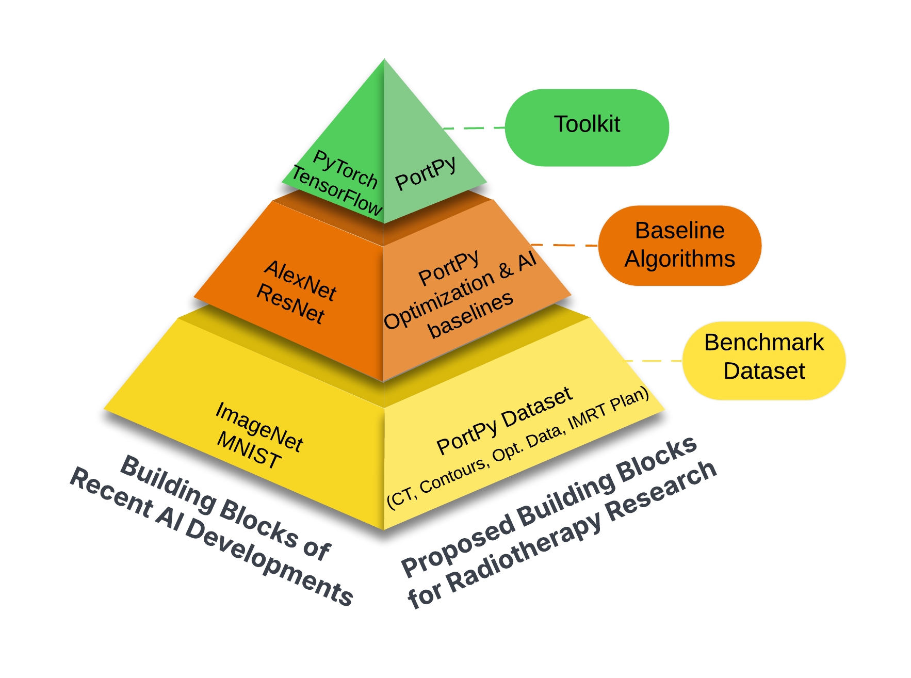

# **What is PortPy?**

**PortPy**, short for **P**lanning and **O**ptimization for **R**adiation **T**herapy, is an open-source Python library 
designed to advance cancer radiotherapy treatment planning optimization. Radiotherapy plays a critical role in 
treating over half of all cancer patients, whether as a standalone treatment or in combination with surgery, 
chemotherapy, or immunotherapy. It works by delivering high-energy radiation beams to tumors, aiming to destroy 
cancerous cells while minimizing damage to the surrounding healthy tissues. 
Given that each patient has a unique anatomy, it is essential to customize the 
radiation beams' shape, angle, and intensity. The goal is to maximize damage to the 
tumor while minimizing exposure to healthy surrounding tissues. This challenge translates into modeling and 
solving large-scale, 
patient-specific mathematical optimization problems. PortPy aims to accelerate research 
in this interdisciplinary field by offering **tools**, **baseline algorithms**, and **benhcmark datasets**.

## 🚀 Main Features

- **IMRT/VMAT Planning Optimization (including AI):**  
  Includes support for IMRT fluence map optimization and leaf sequencing (see [notebook](https://github.com/PortPy-Project/PortPy/blob/master/examples/1_basic_tutorial.ipynb)), 
VMAT direct aperture optimization 
(see [notebook](https://github.com/PortPy-Project/PortPy/blob/master/examples/vmat_scp_tutorial.ipynb)), 
AI-based dose-prediction IMRT 
(see [notebook](https://github.com/PortPy-Project/PortPy/blob/master/examples/imrt_dose_prediction.ipynb)) 
and VMAT (see [notebook](https://github.com/PortPy-Project/PortPy/blob/master/examples/vmat_scp_dose_prediction.ipynb)) planning. 

- **Integration with Commercial TPS:**  
  PortPy outputs IMRT/VMAT plans in DICOM-RT format which can be exported into commercial TPSs 
(see [notebook](https://github.com/PortPy-Project/PortPy/blob/master/examples/vmat_tps_import.ipynb)). For Eclipse TPS users:
    - PortPy outputs IMRT optimal fluence maps in an Eclipse-compatible format (see [notebook](https://github.com/PortPy-Project/PortPy/blob/master/examples/imrt_tps_import.ipynb)).
    - It supports automated data extraction (e.g., beamlets, voxels, dose influence matrix)  
  from Eclipse via its scripting API in a PortPy-compatible format (see [notebook](https://github.com/PortPy-Project/PortPy/blob/master/examples/eclipse_photon_dose_calculation.ipynb)).

- **Benchmark Datasets:**  
  Provides access to a curated dataset of **100 lung cancer patients** with all necessary components for treatment planning optimization 
(beamlet, voxel, pre-computed dose influence matrix). IMRT plans generated using our in-house automated planning 
system, **ECHO**, are included for benchmarking  

- **Globally Optimal IMRT/VMAT Plans:**  
  Implements slow but exact algorithms (e.g., Mixed-Integer Programming) to compute globally optimal plans, useful for benchmarking and validating heuristic algorithms.

## 📢 News
- **[PortPy v1.1.0 released]** The following features have been added:
    
     - **Eclipse users can use their own dataset**: For more info, see [notebook](https://github.com/PortPy-Project/PortPy/blob/master/examples/eclipse_photon_dose_calculation.ipynb).
     - **Lung benchmark dataset expanded**: Lung dataset expanded to 100 patients and is now hosted on [HuggingFace](https://huggingface.co/datasets/PortPy-Project), 
      making it easier to access and use them in your research (see [notebook](https://github.com/PortPy-Project/PortPy/blob/master/examples/1_basic_tutorial.ipynb)).
     - **VMAT column generation algorithm added**: It finds a "warm start" 
      (i.e., good but not neceassirily optimal) solution quickly for the current VMAT SCP (Sequential Convex Programming) optimization algorithm (see [notebook](https://github.com/PortPy-Project/PortPy/blob/master/examples/vmat_scp_tutorial.ipynb)).
     - **Enhanced visualization**: The evaluation table has been improved for better readability and analysis (see [notebook](https://github.com/PortPy-Project/PortPy/blob/master/examples/1_basic_tutorial.ipynb)). 

[//]: # ()
[//]: # (## 🚀 Key Components: Benchmark Datasets, Baseline Algorithms, and PortPy Toolkit)

[//]: # ()
[//]: # ()

[//]: # (  )
[//]: # (This pyramid figure illustrates the inspiration behind developing PortPy, drawing from )

[//]: # (successful open-source practices in the AI and computer science communities. )

[//]: # (Tools like PyTorch and TensorFlow, along with benchmark datasets such as )

[//]: # (ImageNet and algorithms like AlexNet, have revolutionized AI and data science. )

[//]: # (Our goal is to replicate this successful model in the field of radiotherapy by )

[//]: # (equipping researchers with PortPy toolkit, benchmark algorithms, and datasets, )

[//]: # (as outlined below:)

[//]: # ()
[//]: # (1. **PortPy Toolkit**. A set of python classes and functions allowing users to load the data, )

[//]: # (generate IMRT/VMAT plans, and evaluate/visualize the results. For more info, see our Jupyter Notebooks [basic_tutorial]&#40;&#41;)

[//]: # (2. **Benchmark Datasets**. We have curated and made publicly available a dataset of 100 lung cancer patients,)

[//]: # (which includes all the necessary data for treatment plan optimization &#40;e.g., beamlets, voxels, pre-computed dose influence matrix&#41;. )

[//]: # (These data are extracted from the commercial Eclipse treatment planning system using its API. Using your own data is currently only supported for Eclipse TPS users. For more info, see our Jupyter Notebooks &#40;[eclipse_photon_dose_calculation]&#40;https://github.com/PortPy-Project/PortPy/blob/master/examples/eclipse_photon_dose_calculation.ipynb&#41;)

[//]: # (3. **Baseline Algorithms**. This includes two sets of algorithms: 1&#41; fast algorithms that can generate IMRT/VMAT plans within the clinical time-frame &#40;in oder of minutes/hours&#41;,)

[//]: # (2&#41; slow algorithms that can generate globally optimal plans for benchmaking purposes. These plans could take weeks to generate and often involve some simplistic assumptions &#40;e.g., ignoring plan delivery efficiency in VMAT&#41;.)

[//]: # ()
[//]: # (> Modern Portfolio Optimization in Python)

[//]: # ()
[//]: # (---)

[//]: # (Test7)

[//]: # (Welcome to **PortPy**! Effortlessly optimize, analyze, and visualize your investment portfolios with a modern, user-friendly Python library.)

[//]: # ()
[//]: # (
)

[//]: # (  )

[//]: # (
)

[//]: # ()
[//]: # (---)

[//]: # ()
[//]: # ()
[//]: # ()
[//]: # (---)

[//]: # ()
[//]: # (## Get Started)

[//]: # ()
[//]: # (- [Installation Guide]&#40;installation.md&#41;)

[//]: # (- [Quickstart Tutorial]&#40;quickstart.md&#41;)

[//]: # (- [API Reference]&#40;reference/&#41;)

[//]: # (- [GitHub Repository]&#40;https://github.com/your-org/portpy&#41;)

[//]: # ()
[//]: # (---)

[//]: # ()
[//]: # (---)

[//]: # ()
[//]: # (
)

[//]: # (  <a href="quickstart.md"><b>Start Optimizing Your Portfolio →</b></a>)

[//]: # (
)

