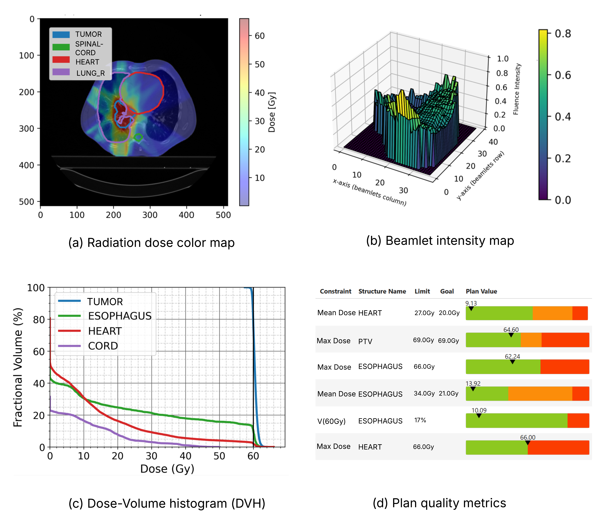
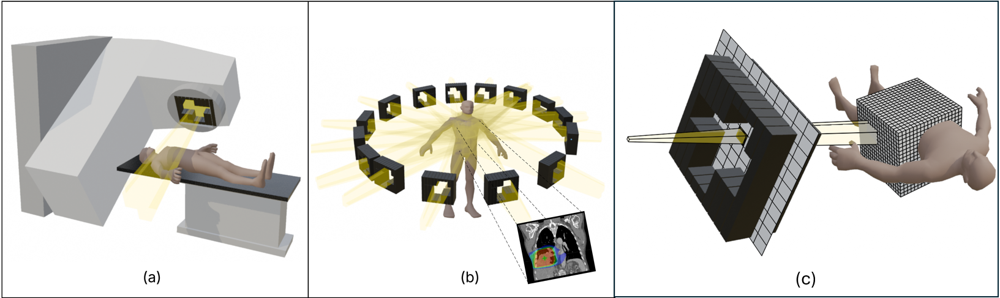

# **What is PortPy?**

**PortPy**, short for **P**lanning and **O**ptimization for **R**adiation **T**herapy, is an open-source Python library 
designed to advance cancer radiotherapy treatment planning optimization. Radiotherapy plays a critical role in 
treating over half of all cancer patients, whether as a standalone treatment or in combination with surgery, 
chemotherapy, or immunotherapy. It works by delivering high-energy radiation beams to tumors, aiming to destroy 
cancerous cells while minimizing damage to the surrounding healthy tissues. 
Since every patient has a unique anatomy, the radiation beam’s shape, angle, and intensity must be carefully 
customized. The objective is to maximize tumor dose while minimizing exposure to nearby organs at risk—a 
challenge that translates into solving large-scale, patient-specific mathematical optimization problems.

PortPy aims to accelerate research in this interdisciplinary field by providing tools and algorithms 
to model and solve these complex optimization problems, as well as to visualize and quantitatively 
evaluate the resulting treatment plans (see image below).

[//]: # ()
[//]: # (# 👀 What is Radiotherapy Treatment Planning Optimization?)

[//]: # ()

[//]: # ()
[//]: # (In radiotherapy, the patient lies on a couch while a )

[//]: # (linear accelerator rotates around them to deliver radiation &#40;Figure a&#41;. The radiation beams are shaped using )

[//]: # (a set of metal leaves known as a multi-leaf collimator &#40;MLC&#41;, which dynamically move in-and-out to modulate )

[//]: # (the beam shape. This allows radiation to be precisely targeted at the tumor from multiple directions, )

[//]: # (effectively placing it in the crossfire &#40;Figure b&#41;. Optimizing the angle, shape, and intensity of these )

[//]: # (beams for each individual patient, can be formulated as a mathematical optimization problem. )

[//]: # (For this, the patient's anatomy is discretized into 3D voxels and each beam is subdivided into 2D beamlets and )

[//]: # (the radiation dose contribution from each beamlet to each )

[//]: # (voxel is precomputed &#40;Figure c&#41;, and stored in a matrix commonly referred to as the dose influence matrix )

[//]: # (&#40;or dose deposition matrix&#41;. )

[//]: # ()
[//]: # (PortPy provides tools to model and solve these optimization problems that are often large-scale and non-convex.)

[//]: # (PortPy also provides a set of tools for visual and quantitative assessment of treatment plans, including: dose distribution &#40;Figure e&#41;)

[//]: # (beamlet intensity maps for individual beams &#40;Figure e&#41;, dose-volume histograms &#40;DVHs, Figure f&#41;, and a color-coded table that)

[//]: # (compares quantitative dose metrics against clinical criteria &#40;Figure g&#41;.)

[//]: # ()
[//]: # ()

[//]: # ()

## 🚀 PortPy Main Features

- **IMRT/VMAT Planning Optimization (including AI):**  
  Includes support for IMRT fluence map optimization and leaf sequencing (see [notebook](https://github.com/PortPy-Project/PortPy/blob/master/examples/1_basic_tutorial.ipynb)), 
VMAT direct aperture optimization 
(see [notebook](https://github.com/PortPy-Project/PortPy/blob/master/examples/vmat_scp_tutorial.ipynb)), 
AI-based dose-prediction IMRT 
(see [notebook](https://github.com/PortPy-Project/PortPy/blob/master/examples/imrt_dose_prediction.ipynb)) 
and VMAT (see [notebook](https://github.com/PortPy-Project/PortPy/blob/master/examples/vmat_scp_dose_prediction.ipynb)) planning. 

- **Integration with Commercial TPS:**  
  PortPy outputs IMRT/VMAT plans in DICOM-RT format which can be exported into commercial TPSs 
(see [notebook](https://github.com/PortPy-Project/PortPy/blob/master/examples/vmat_tps_import.ipynb)). For Eclipse TPS users:
    - PortPy outputs IMRT optimal fluence maps in an Eclipse-compatible format (see [notebook](https://github.com/PortPy-Project/PortPy/blob/master/examples/imrt_tps_import.ipynb)).
    - It supports automated data extraction (e.g., beamlets, voxels, dose influence matrix)  
  from Eclipse via its scripting API in a PortPy-compatible format (see [notebook](https://github.com/PortPy-Project/PortPy/blob/master/examples/eclipse_photon_dose_calculation.ipynb)).

- **Benchmark Datasets:**  
  Provides access to a curated dataset of **100 lung cancer patients** with all necessary components for treatment planning optimization 
(beamlet, voxel, pre-computed dose influence matrix). IMRT plans generated using our in-house automated planning 
system, **ECHO**, are included for benchmarking  

- **Globally Optimal IMRT/VMAT Plans:**  
  Implements slow but exact algorithms (e.g., Mixed-Integer Programming) to compute globally optimal plans, useful for benchmarking and validating heuristic algorithms.

## 📢 News
- **[PortPy v1.1.1 released]** The following features have been added:

     - **Prostate dataset added**: 129 Prostate patients have been added and is now hosted on [HuggingFace](https://huggingface.co/datasets/PortPy-Project). This dataset expands PortPy’s resources for advancing radiotherapy research(see [notebook](https://github.com/PortPy-Project/PortPy/blob/master/examples/1_basic_tutorial.ipynb)).
     - **Enhanced data explorer**: Added new methods to DataExplorer for accessing data directly from Hugging Face.
     - **Faster optimization**: Eliminated redundant constraints for faster optimization.

- **[PortPy v1.1.0 released]** The following features have been added:
    
     - **Eclipse users can use their own dataset**: For more info, see [notebook](https://github.com/PortPy-Project/PortPy/blob/master/examples/eclipse_photon_dose_calculation.ipynb).
     - **Lung benchmark dataset expanded**: Lung dataset expanded to 100 patients and is now hosted on [HuggingFace](https://huggingface.co/datasets/PortPy-Project), 
      making it easier to access and use them in your research (see [notebook](https://github.com/PortPy-Project/PortPy/blob/master/examples/1_basic_tutorial.ipynb)).
     - **VMAT column generation algorithm added**: It finds a "warm start" 
      (i.e., good but not neceassirily optimal) solution quickly for the current VMAT SCP (Sequential Convex Programming) optimization algorithm (see [notebook](https://github.com/PortPy-Project/PortPy/blob/master/examples/vmat_scp_tutorial.ipynb)).
     - **Enhanced visualization**: The evaluation table has been improved for better readability and analysis (see [notebook](https://github.com/PortPy-Project/PortPy/blob/master/examples/1_basic_tutorial.ipynb)). 

## 🛎️ Join Our Mailing List
- **Subscribe to receive news about major releases and new features.**
<iframe src="https://docs.google.com/forms/d/e/1FAIpQLSciIhxOCXT_x4BjODfkhdQe_Fx1vU0xrJ4X3HJsTPH-GLfaqg/viewform?embedded=true" width="640" height="553" frameborder="0" marginheight="0" marginwidth="0">Loading…</iframe>
